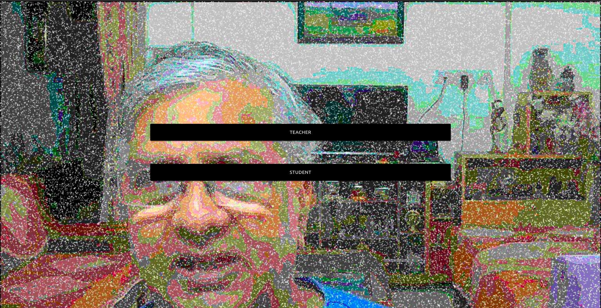

# Quizapp

## Check out hosted webapp on 

https://murty4lyf.netlify.app/

Purely front end project for setting and answering
questions set dynamically by logging in as teacher.

## Technologies

* React app
* Local Storage utilised to store scores
* Materialize css classes

## Some images of project

### Home Page

### Setting Question(teacher)

### Answer Page(student)

### Result Page

# Dev setup

* git clone https://github.com/ankitpal1029/quizapp.git
* cd quizapp
* npm install
* npm start
